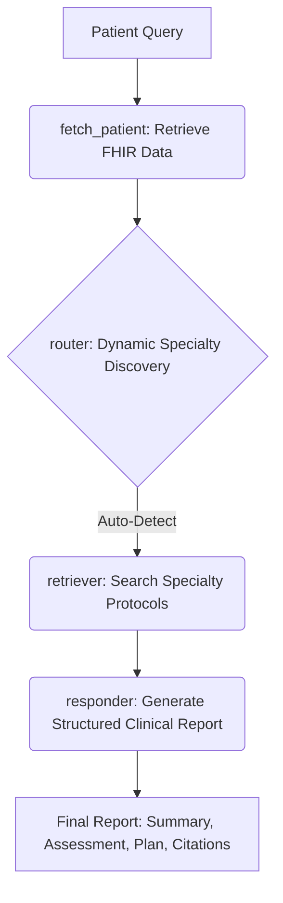

# 🩺 Clinica-Router AI | The Healthcare AI Endgame

[](https://opensource.org/licenses/MIT)
[](https://www.python.org/downloads/)
[](https://fastapi.tiangolo.com/)
[](https://python.langchain.com/docs/langgraph)
[](https://groq.com/)

**Clinica-Router AI** is an advanced, agentic medical intelligence layer designed to orchestrate complex clinical inquiries. Built with **LangGraph** and following **Clean Architecture** principles, it serves as the intelligent brain for the *Healthcare AI Endgame* initiative, ensuring medical queries are routed to the correct expertise with verified citations.

---

## 🌟 Vision (الرؤية)

> **"المنصة المركزية لإدارة الجيل القادم من الذكاء الاصطناعي السريري. يجمع هذا المستودع بين الوكلاء الطبيين المستقلين، ومنطق التوجيه المتطور، وقاعدة معرفية مدعومة بتقنية RAG لتوفير دعم فائق لاتخاذ القرارات الطبية."**

---

## 🚀 Key Features

- **Scalable Agentic Routing**: Uses dynamic graph-based logic (LangGraph) to classify and route queries across an extensible range of specialties (Cardiology, Pediatrics, Drug Safety, Oncology, Neurology, etc.).
- **Structured Clinical Reporting**: Generates standardized, professional reports containing Summary, Assessment, Plan, and Recommendations.
- **RAG-Powered Intelligence**: Integrated Retrieval-Augmented Generation using **ChromaDB** and **HuggingFace Embeddings** for guideline-backed responses.
- **Clean Architecture**: Decoupled Domain, Application, and Infrastructure layers for maximum scalability and testability.
- **Multi-LLM Integration**: Leverages **Groq (Llama 3.1)** for blazing-fast inference and high-reasoning capabilities.
- **Context-Aware**: Integrates simulated patient data (FHIR-compliant) to personalize clinical responses.
- **Verified Citations**: Every report is backed by specific page references from medical protocols.

---

## 🧠 Agentic Workflow (LangGraph)

Clinica-Router AI uses **LangGraph** to manage the clinical reasoning cycle. Unlike traditional linear chains, this graph-based approach allows for complex state management, conditional routing, and robust error handling.



### Why LangGraph?
- **State Management**: Maintains a unified `ClinicaState` across the entire lifecycle.
- **Conditional Logic**: Dynamically switches between retrieval collections based on LLM routing.
- **Error Resilience**: Gracefully handles missing data or retrieval failures through dedicated nodes.

---

## 🛠️ Technology Stack

- **Backend**: FastAPI
- **AI Orchestration**: LangGraph, LangChain
- **LLM**: Groq (Llama-3.1-8b-instant)
- **Embeddings**: HuggingFace (all-MiniLM-L6-v2)
- **Database**: ChromaDB (Vector Store)
- **Data Format**: PDF ingestion for medical protocols

---

## 📂 Project Structure

```text
clinica_router_ai/
├── application/       # LangGraph state machine and use cases
├── domain/            # Entities and interface definitions
├── infrastructure/    # LLM wrappers, vector stores, and external API clients
├── interfaces/        # FastAPI routers and Pydantic schemas
├── data/              # Medical protocols (PDFs) organized by specialty
├── scripts/           # Ingestion and verification utilities
└── main.py            # Application entry point
```

---

## 💻 Setup Instructions

### 1. Clone & Install
```bash
git clone https://github.com/Mh-NOUHICoder/Healthcare-AI-Endgame.git
cd Healthcare-AI-Endgame
python -m venv venv
source venv/bin/activate  # Windows: venv\Scripts\activate
pip install -r requirements.txt
```

### 2. Configuration
Copy the template and add your API keys:
```bash
cp .env.example .env
```
*Required: `GROQ_API_KEY`, `GEMINI_API_KEY` (for additional modules).*

### 3. Data Ingestion
Populate the `data/` folder with specialty PDFs and run:
```bash
python scripts/load_protocols.py
```

### 4. Run the Engine
```bash
uvicorn main:app --reload
```

---

## 🧪 Testing the Intelligence

You can verify the routing using the comprehensive `routing_test_suite.txt` or a simple curl command:

```bash
curl -X POST "http://localhost:8000/router" \
     -H "Content-Type: application/json" \
     -d '{"patient_id": "p-001", "query": "What are the risks of taking Lisinopril for high blood pressure?"}'
```

---

## 📄 License
This project is licensed under the MIT License - see the [LICENSE](LICENSE) file for details.

---
*Developed as part of the **Healthcare AI Endgame** initiative.*
